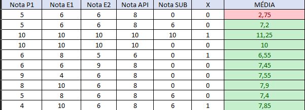
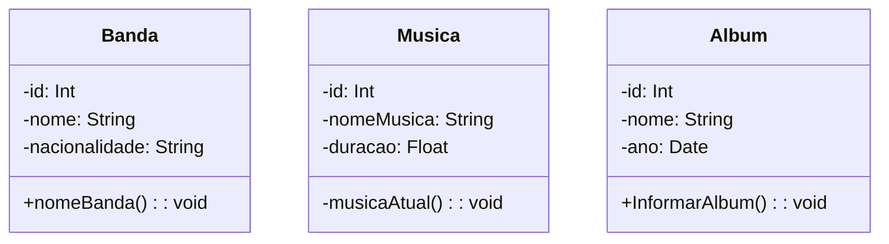
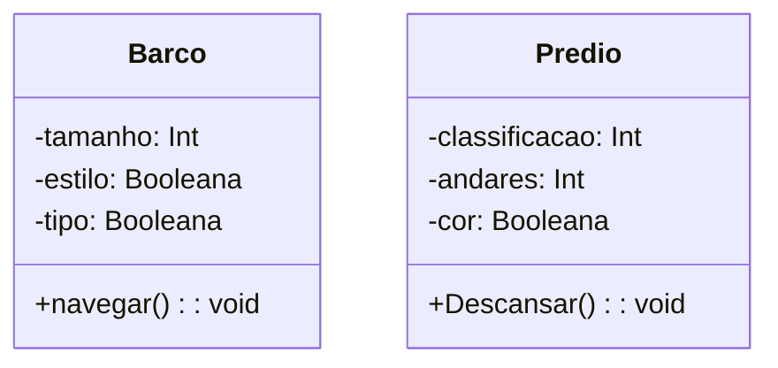
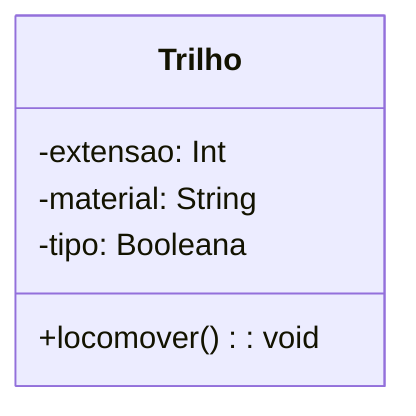
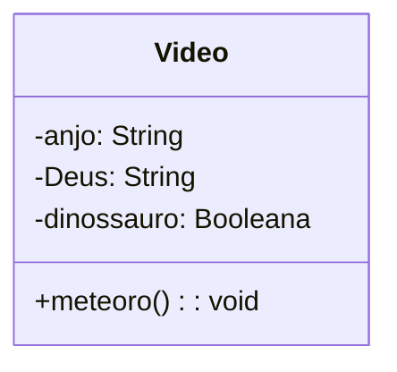

<h1 align="center">Linguagem de Programação   

<h3> Tabela de Notas:</h3>

---
<h3> Musica: Don's Cry - Guns N' Roses </h3>

<h3> Diagrama UML da Musica: </h3>

<h3> Diagrama UML da imagem Lampedusa: </h3>

<h3> Diagrama UML da imagem Track brawl: </h3>

<h3>Video:</h3>
https://www.youtube.com/shorts/KyugePrPAsE
</a>

<h3>Doodle da minha preferência</h3>
<h4>ESPN - SUPER BOWL 2020</h4>
 
